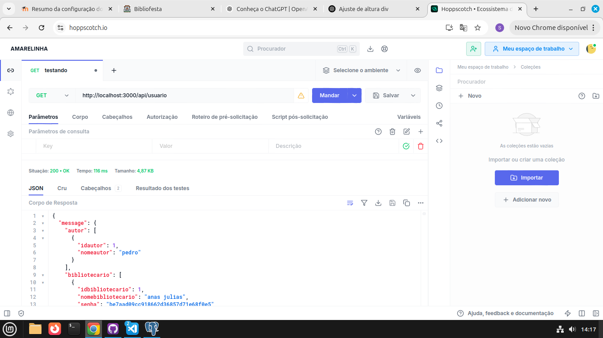

# Bibliofesta Backend

## 🚀 Descrição do Projeto
Backend da nossa biblioteca **"Bibliofesta"**, com uso das ferramentas Javascript **Node.js** e **Express**, com todas as rotas REST básicas (GET, POST PUT, DELETE)

## 💻 Tecnologias Utilizadas
- 
- 
- 
- 
- 
- 
- 
  
## 📊 Status do Projeto
- [ ] 🚫 Não Feito
- [x] 🔄 Em Andamento
- [ ] ✅ Concluído

## 🛠️ Instalação e Execução
- Clone o repositório e abra um terminal nele
```
git clone https://github.com/PedrinnhoUtumi/TrabalhoBiblioteca.git

cd TrabalhoBiblioteca
```
- Instale suas dependências
```
npm i
```
ou
```
npm install
```
- Execute o servidor
```
node app.js
```

## 📁 Estrutura 
```
biblioteca-backend/
│
├── config/ 
├── controller/
├── entities/           
├── imagens/              
├── model/
├── .env                  
├── .gitignore                  
├── app.js                
├── package-lock.json          
├── package.json          
└── README.md             
```
## ˖°📷༘ Exemplo de uso


## 👥 Integrantes
- [Sara Guaiume](https://github.com/saraqwe123) -> Responsável pelos daos e controllers
- [Pedro Utumi](https://github.com/PedrinnhoUtumi/) -> Responsável pelas rotas e documentações